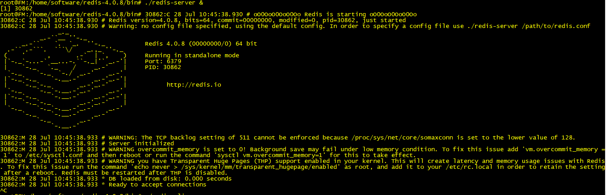
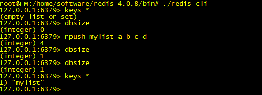
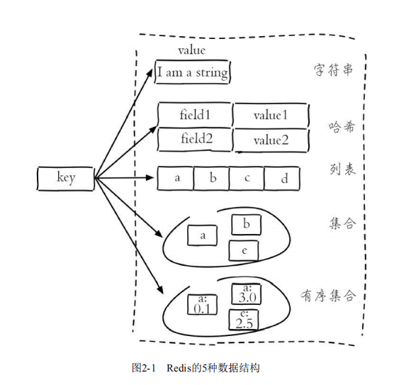
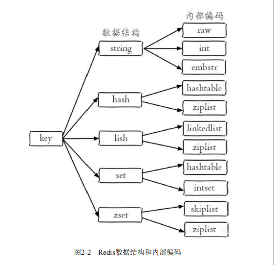
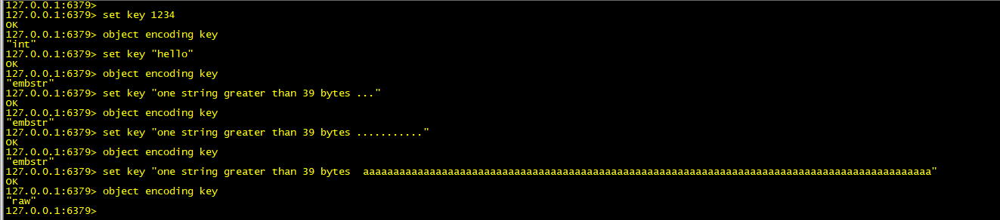

> Redis 简介

- Redis 全称是  Remote Dictionary Server
- Redis 是一种基于键值对(key-value)的NoSQL数据库，Redis的值可以是由string(字符串)、hash(哈希)、list(列表)、set(集合)、zset(有序集合)、Bitmaps(位图)、HyperLogLog、GEO(地理信息定位)等多种数据结构和算法组成；
- Redis会将所有数据都存放在内存中，所以它的读写性能非常惊人；
- Redis还可以将内存的数据利用快照和日志的形式保存到硬盘上，这样发生类似断电或者机器故障的时候，内存中的数据不会"丢失";
- Redis提供了键过期、发布订阅、事务、流水线、Lua脚本等附加功能。

> Redis 特性

- 速度快 (读写性能 10万/秒)

- - Redis的所有数据都是存放在内存中
- - Redis是用C语言实现的
- - Redis使用了单线程架构，预防了多线程可能产生的竞争问题

- 基于键值对的数据结构服务器
- 丰富的功能(键过期、发布订阅实现消息系统)
- 简单稳定
- 客户端语言多(支持Redis的客户端语言非常多,Java、PHP、Python、C、C++、Nodejs等)
- 持久化 (Redis 提供了两种持久化方式:RDB 和 AOF)
- 主从复制
- 高可用和分布式

> Redis 启动

- 启动redis-server  到  /home/software/redis-4.0.8/bin  执行  ./redis-server &

- 启动redis-cli  
  

- - dbsize 命令会返回当前数据库中键的总数
- - dbsize 命令在计算键总数时不会遍历所有键，而是直接获取Redis内置的键总数变量，所以dbsize命令的时间复杂度是O(1)
- - keys 命令会遍历所有键，时间复杂度O(n),当Redis保存了大量键时，线上环境禁止使用

> 数据结构和内部编码

- 数据结构

;

- 内部编码

> 单线程架构

- Redis使用了单线程架构和I/O多路复用模型来实现高性能的内存数据库服务
- 因为Redis是单线程来处理命令的，所以一条命令从客户端到服务器不会立刻被执行，所以命令都会进入一个队列中，然后逐个被执行.

> 为什么单线程还能这么快

- 纯内存访问，Redis将所有数据放在内存中，内存的响应时长大约为100纳秒，这是Redis达到每秒万级别访问的重要基础
- 非阻塞I/O，Redis使用epoll作为I/O多路复用技术的实现，再加上Redis自身的事件处理模型将epoll中的连接、读写、关闭都转换为事件，不在网络I/O上浪费过多的时间
- 单线程避免了线程切换和竞态产生的消耗

> 字符串  字符串类型是Redis最基本的数据结构,最大值不能超过512MB

- setnx  如果有多个客户端同时执行 setnx  key  value，根据setnx 的特性只有一个客户端能设置成功，setnx可以作为分布式锁的一种实现方案

- 内部编码

- - 字符串类型的内部编码有3中：
- - 1. int 8个字节的长整形
- - 2. ember 小于等于39个字节的字符串
- - 3. raw  大于39个字节的字符串
- - Redis 会根据当前值的类型和长度决定使用哪种内部编码实现

> 哈希 

- 在使用hgetall时，如果哈希元素个数比较多，会存在阻塞Redis的可能；可以使用hscan命令，该命令会渐进式遍历哈希类型

- 哈希类型的内部编码有两种：
- - 1. ziplist(压缩列表): 当哈希类型元素个数小于hash-max-ziplist-entries配置(默认512个)、同时所有值都小于hash-max-ziplist-value配置(默认64字节)时，Redis会使用ziplist作为哈希的内部实现，ziplist使用更加紧凑的解构实现多个元素的连续存储，所以在节省内存方面比hashtable更加优秀
- - 2. hashtable(哈希表): 当哈希类型无法满足ziplist的条件时，Redis会使用hashtable作为哈希的内部实现，因为此时ziplist的读写效率会下降，而hashtable的读写事件复杂度为O(1),hashtable 会消耗更多内存
