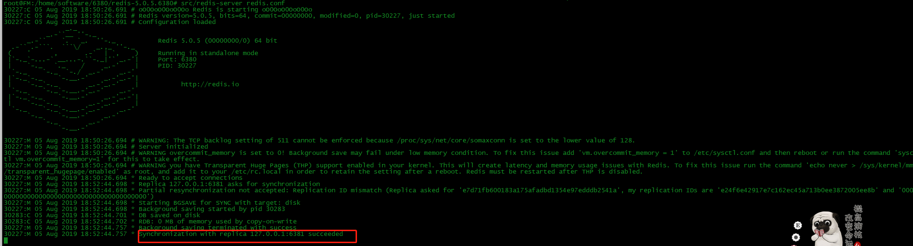
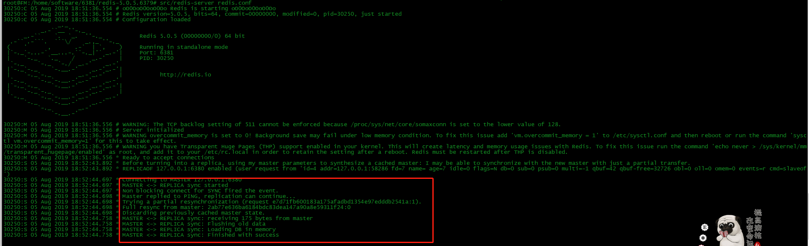
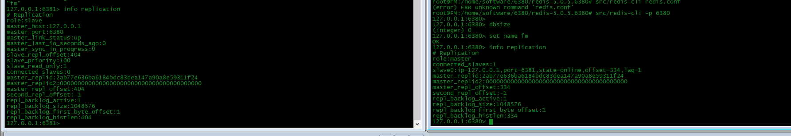
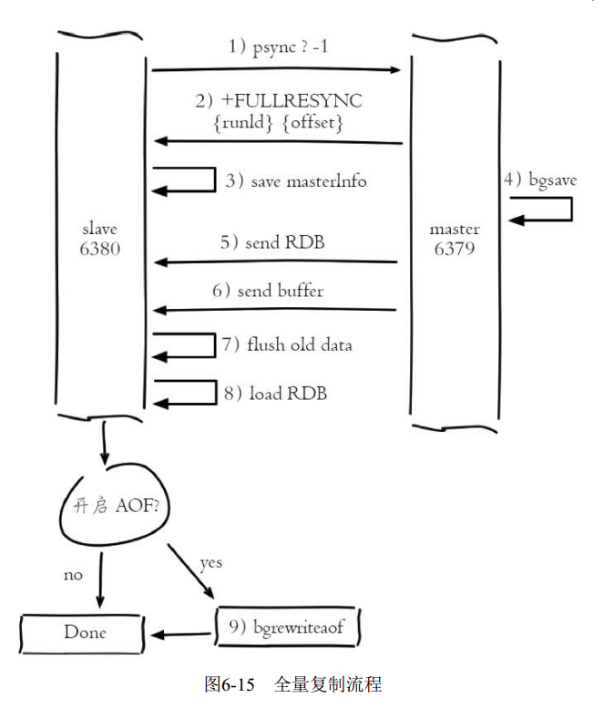
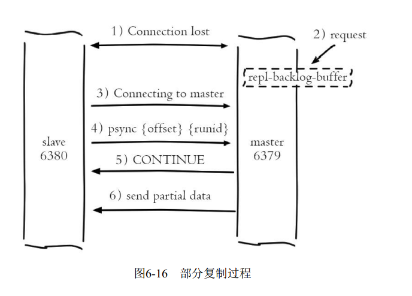

> Redis 主从复制

- Redis 实例划分为主节点(master)和从节点(slave)
- 默认情况下，Redis都是主节点
- 每个从节点只能有一个主节点，而主节点可以同时具有多个从节点
- 复制的数据流是单向的，只能由主节点复制到从节点
- slaveof 命令在使用时，可以运行期动态配置，也可以提前写到配置文件中

- 主从复制

|步骤| 详细描述|
|---|---|
|保存主节点信息| 执行slaveof后从节点只保存主节点的地址信息便直接返回|
|主从建立socket连接| 从节点(slave)内部通过每秒运行的定时任务维护复制相关逻辑，当定时任务发现存在新的主节点后，会尝试与该节点建立网络连接;从节点会建立一个socket套接字，专门用于接受住节点发送的复制命令；如果从节点无法建立连接，定时任务会无限重试直到连接成功或者执行 slaveof no one 取消复制|
|发送ping命令| 连接建立成功后从节点发送ping请求进行首次通信，ping请求的目的：检测主从之间套接字是否可用；检测主节点当前是否可接受处理命令.如果发送ping命令后，从节点没有收到主节点的pong回复或者超时，比如网络超时或者主节点正在阻塞无法响应命令，从节点会端口复制连接，下次定时任务会发起重连|
|权限验证| 如果主节点设置了requirepass 参数，则需要密码验证，从节点必须配置masterauth参数保证与主节点相同的密码才能通过验证；如果验证失败复制将终止，从节点重新发起复制流程|
|同步数据集|主从复制连接正常通信后，对于首次建立复制的场景，主节点会把持有的数据全部发送给从节点.|
|命令持续复制|当主节点把当前的数据同步给从节点后，变成了复制的建立流程，接下来主节点会持续地把写命令发送给从节点，保证主从数据一致性|

- 启动6380、6381
- 6381 执行命令
```
127.0.0.1:6381> slaveof 127.0.0.1 6380

Redis5.0.0 改为 ： replicaof <masterip> <masterport>

```
- 6380 启动
- 
- 6381 启动
- 

- 查看info replication
- 

> 数据同步

| 类型 | 描述 |
| --- | --- |
| 全量复制 | 一般用于初次复制场景，Redis早期支持的复制功能只有全量复制，它会把主节点全部数据一次性发送给从节点，当数据量较大时，会对主从节点和网络造成很大的开销 |
| 部分复制 | 用于处理在主从复制中因网络闪断等原因造成的数据丢失场景，当从节点再次连上主节点后，如果条件允许，主节点会补发丢失数据给从节点。因为补发的数据远远小于全量数据，可以有效避免全量复制的过高开销 |

> 复制偏移量

| 参数 | 描述 |
| -- | -- |
| master_repl_offset | 参与复制的主从节点都会维护自身复制偏移量。主节点(master)在处理完写入命令后，会把命令的字节长度做累加记录，统计信息在info replication中的master_repl_offset指标中 |
| slave0 | 从节点(slave) 每秒钟上报自身的复制偏移量给主节点，因此主节点也会保存从节点的复制偏移量 |
| slave_repl_offset | 从节点在接收到主节点发送的命令后，也会累加记录自身的偏移量。 |
- 通过对比主从节点的复制偏移量，可以判断主从节点数据是否一致

> 复制积压缓冲区

- 复制积压缓冲区是保存在主节点上的一个固定长度的队列，默认大小为1MB，当主节点有连接的从节点(slave)时被创建，这是主节点(master)响应写命令时，不但会把命名发送给从节点，还会写入复制积压缓冲区

- 由于缓冲区本质上是先进先出的定长队列，所以能实现保存最近已复制数据的功能，用于部分复制和复制命令丢失的数据补救

|参数 | 描述 |
| -- | -- |
|repl_backlog_active:1 | 开启复制缓冲区 |
|repl_backlog_size:1048576| 缓冲区最大长度 |
|repl_backlog_first_byte_offset:1| 起始偏移量，计算当前缓冲区可用范围 |
|repl_backlog_histlen:2301| 已保存数据的有效长度 |
|master_replid | 主节点实例的master_replid相同
|master_replid2 | 未发生切换，即主实例未发生过变化，所以初始值为0|

> psync 命令

- 从节点使用psync命令完成部分复制和全量复制功能
```
30227:M 05 Aug 2019 18:52:44.698 * Replica 127.0.0.1:6381 asks for synchronization
30227:M 05 Aug 2019 18:52:44.698 * Partial resynchronization not accepted: Replication ID mismatch (Replica asked for 'e7d71fb600183a175afadbd1354e97edddb2541a', my replication IDs are 'e24f6e42917e7c162ec45a713b0ee3872005ee8b' and '0000000000000000000000000000000000000000')
```


> 6381 从节点打印分析

```
31771:S 06 Aug 2019 12:21:40.213 * DB loaded from disk: 0.000 seconds
31771:S 06 Aug 2019 12:21:40.213 * Before turning into a replica, using my master parameters to synthesize a cached master: I may be able to synchronize with the new master with just a partial transfer.
#启动成功
31771:S 06 Aug 2019 12:21:40.213 * Ready to accept connections
# 开始连接主节点
31771:S 06 Aug 2019 12:21:40.214 * Connecting to MASTER 127.0.0.1:6380
# 开始同步
31771:S 06 Aug 2019 12:21:40.214 * MASTER <-> REPLICA sync started
31771:S 06 Aug 2019 12:21:40.214 * Non blocking connect for SYNC fired the event.
31771:S 06 Aug 2019 12:21:40.214 * Master replied to PING, replication can continue...
# 尝试增量同步
31771:S 06 Aug 2019 12:21:40.214 * Trying a partial resynchronization (request 668b25f85e84c5900e1032e4b5e1f038f01cfa49:5895).
# 全量同步
31771:S 06 Aug 2019 12:21:40.215 * Full resync from master: c88cd043d66193e867929d9d5fadc952954371e5:0
31771:S 06 Aug 2019 12:21:40.215 * Discarding previously cached master state.
31771:S 06 Aug 2019 12:21:40.240 * MASTER <-> REPLICA sync: receiving 224 bytes from master
31771:S 06 Aug 2019 12:21:40.241 * MASTER <-> REPLICA sync: Flushing old data
31771:S 06 Aug 2019 12:21:40.241 * MASTER <-> REPLICA sync: Loading DB in memory
31771:S 06 Aug 2019 12:21:40.241 * MASTER <-> REPLICA sync: Finished with success
```

> 全量复制

- 

- 全量复制是Redis最早支持的复制方式，也是主从第一次建立复制时必须经历的阶段。触发全量复制的命令是sync和psync
- - 1. 发送psync命令进行数据同步，由于是第一次进行复制，从节点没有复制偏移量和主节点的运行ID，所以发送psync-1
- - 2. 主节点根据psync-1解析出当前为全量复制，回复+FULLRESYNC响应
- - 3. 从节点接收主节点的响应数据保存运行ID和偏移量offset
- - 4. 主节点执行bgsave保存RDB文件到本地

```
31651:M 06 Aug 2019 11:08:40.802 * Starting BGSAVE for SYNC with target: disk
31651:M 06 Aug 2019 11:08:40.802 * Background saving started by pid 31676
31676:C 06 Aug 2019 11:08:40.805 * DB saved on disk
31676:C 06 Aug 2019 11:08:40.806 * RDB: 0 MB of memory used by copy-on-write
31651:M 06 Aug 2019 11:08:40.886 * Background saving terminated with success
31651:M 06 Aug 2019 11:08:40.886 * Synchronization with replica 127.0.0.1:6381 succeeded
```
- - 5. 主节点发送RDB给从节点，从节点把接收的RDB文件保存在本地并直接作为从节点的数据文件,接收完RDB后从节点打印相关日志

```
31645:S 06 Aug 2019 11:08:40.886 * MASTER <-> REPLICA sync: receiving 224 bytes from master
```
- - 6. 对于从节点开始接收RDB快照到接收完成期间，主节点仍然响应读写命令，因此主节点会把这期间写命令数据保存在复制客户端缓冲区内，当从节点加载完RDB文件后，主节点再把缓冲区内的数据发送个从节点，保证主从之间数据一致性。

- - redis.conf 配置

```
client-output-buffer-limit replica 256mb 64mb 60
```
- - 如果主节点创建和传输RDB的时间过长，对于高流量写入场景非常容易造成主节点复制客户端缓冲区溢出。默认配置如上所示，如果60秒内缓冲区消耗持续大于64MB或者直接超过256MB时，主节点将直接关闭复制客户端连接，造成全量同步失败

- - 对于主节点，当发送完所有的数据后就认为全量复制完成.

```
31651:M 06 Aug 2019 11:08:40.886 * Synchronization with replica 127.0.0.1:6381 succeeded
```
- - 7. 从节点接收完主节点传送来的全部数据后会清空自身旧数据

```
31645:S 06 Aug 2019 11:08:40.886 * MASTER <-> REPLICA sync: Flushing old data
```

- - 8. 从节点清空数据后开始加载RDB文件，对于较大的RDB文件，这一步操作依然比较耗时，可以通过计算日志之间的时间差来判断加载RDB的总耗时

```
31645:S 06 Aug 2019 11:08:40.886 * MASTER <-> REPLICA sync: Loading DB in memory
31645:S 06 Aug 2019 11:08:40.886 * MASTER <-> REPLICA sync: Finished with success
```

- - 9. 从节点成功加载完RDB后，如果当前节点开启了AOF持久化功能，它会立刻做bgrewriteaof操作，为了保证全量复制后AOF持久化文件立刻可用。

- 全量复制耗时的原因：
- - 主节点bgsave时间
- - RDB文件网络传输时间
- - 从节点清空数据时间
- - 可能的AOF重写时间

- 以下为Redis 3.0才会有

|标识 | 含义 |
|-- | -- |
|M | 当前为主节点日志 |
|S | 当前为从节点日志 |
|C | 子进程日志 |

> 部分复制

- 

- 部分复制主要是Redis针对全量复制的过高开销做出的一种优化措施，使用psync {runId}{offset}命令实现。当从节点(slave)正在复制主节点(master)时，如果出现网络闪断或者命令丢失等异常情况时，从节点会向主节点要求补发丢失的命令数据，如果主节点的复制积压缓冲区内存咋这部分数据则直接发送给从节点，这样就可以保持主从节点复制的一致性。补发的这部分数据一般远远小于全量数据.

- - 1. 当主节点直接网络出现中断是，如果超过repl-timeout时间，主节点会认为从节点故障并中断复制连接

```
31767:M 06 Aug 2019 14:13:26.096 # Connection with replica 127.0.0.1:6381 lost.
```
- - 2. 主从连接中断期间主节点依然响应命令，但因复制连接中断命令无法发送给从节点，不过主节点内部存在的复制积压缓冲区，依然可以保存最近一段时间的写命令数据，默认最大缓存1MB，可以通过into replication 查看
- - 3. 当从节点网络恢复后，从节点会再次连上主节点

```
从节点打印：
31934:S 06 Aug 2019 14:20:54.745 * MASTER <-> REPLICA sync started
31934:S 06 Aug 2019 14:20:54.745 * Non blocking connect for SYNC fired the event.
31934:S 06 Aug 2019 14:20:54.745 * Master replied to PING, replication can continue...
31934:S 06 Aug 2019 14:20:54.745 * Trying a partial resynchronization (request c88cd043d66193e867929d9d5fadc952954371e5:9996).
31934:S 06 Aug 2019 14:20:54.746 * Successful partial resynchronization with master.
31934:S 06 Aug 2019 14:20:54.746 * MASTER <-> REPLICA sync: Master accepted a Partial Resynchronization.

主节点打印：
31767:M 06 Aug 2019 14:21:49.065 * Replica 127.0.0.1:6381 asks for synchronization
31767:M 06 Aug 2019 14:21:49.066 * Partial resynchronization request from 127.0.0.1:6381 accepted. Sending 0 bytes of backlog starting from offset 10066.
```

- - 4. 当主从连接恢复后，由于从节点之前保存了自身已复制的偏移量和主节点的运行ID。因此会把它们当做psync参数发送个主节点，要求进行部分复制操作.从节点对应日志：

```
31938:S 06 Aug 2019 14:21:49.065 * Trying a partial resynchronization (request c88cd043d66193e867929d9d5fadc952954371e5:10066).
```

- - 5. 主节点接到psync命令后首先核对参数runId是否与自身一致，如果一致，说明之前复制的是当前主节点；之后根据参数offset在自身复制积压缓冲区查找，如果偏移量之后的数据存在缓冲区中，则对从节点发送+COUTINUE响应，表示可以进行部分复制。从节点接到回复打印如下：

```
31938:S 06 Aug 2019 14:21:49.066 * Successful partial resynchronization with master.
31938:S 06 Aug 2019 14:21:49.066 * MASTER <-> REPLICA sync: Master accepted a Partial Resynchronization.
```
- - 6. 主节点根据偏移量把复制积压缓冲区里的数据发送给从节点，保证主从复制进入正常状态。发送的数据量可以在主节点的日志获取

```
31767:M 06 Aug 2019 14:21:49.065 * Replica 127.0.0.1:6381 asks for synchronization
31767:M 06 Aug 2019 14:21:49.066 * Partial resynchronization request from 127.0.0.1:6381 accepted. Sending 0 bytes of backlog starting from offset 10066.
```