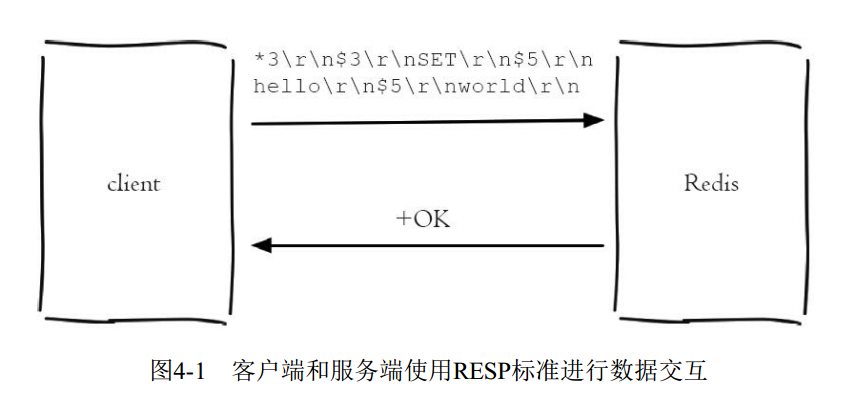
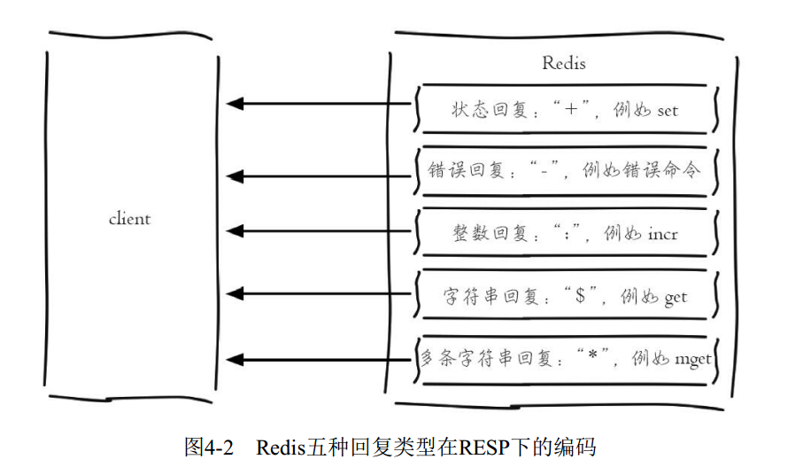
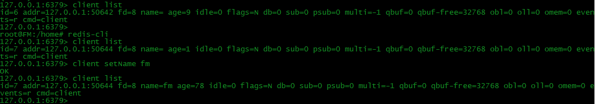
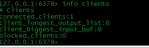

> 客户端通信协议
- 客户端与服务端之间的通信协议是在TCP协议之上构建的
- Redis指定了RESP(REdis Serialization Protocol,Redis序列化协议) 实现客户端与服务端的正常交互

- RESP 命令格式
```
*<参数数量> CRLF  (CRLF 代表\r\n)
$<参数1的字节数量> CRLF
<参数1> CRLF
...
$<参数N的字节数量> CRLF
<参数N> CRLF
```

- 例如 以下为格式化显示结果
```

set RedisRESP 1

*3    //参数为3个
$3
set
$9
RedisRESP
$1
1
```

- 消息传输流程

- 

- Redis 返回类型 
- 

- 采用 nc 命令查看Redis 服务端返回的"真正"结果:
- 

> 客户端API

- client list
- 列出与Redis服务端相连的所有客户端连接信息

- 

```
id=7 addr=127.0.0.1:50644 fd=8 name=fm age=78 idle=0 flags=N db=0 sub=0 psub=0 multi=-1 qbuf=0 qbuf-free=32768 obl=0 oll=0 omem=0 events=r cmd=client
```

|类型 | 描述 |
| -- | -- |
| id |客户端连接的唯一标识，id随着Redis的连接自增，重启Redis重置为0|
|addr| 客户端连接的ip和端口|
| fd| socket的文件描述符，如果fd=-1代表当前客户端不是外部客户端，而是Redis内部的伪装客户端|
| name| 客户端的名称|
|qbuf | 缓冲区的总容量|
|qbuf-free | 缓冲区的剩余容量|
|obl| 缓冲区的长度 |
|oll| 动态缓冲区列表的长度 |
|omem| 使用的字节数 |
|age | 当前客户端已经连接的时间 |
|idle | 当前客户端最近一次的空闲时间 |
| flag| 用于标识当前客户端的类型 flag=S 当前客户端是slave客户端；flag=N 当前客户端为普通客户端;flag=O 当前客户端正在执行monitor命令|

- Redis为每个客户端分配了输入缓冲区，它的作用是将客户端发送的命令临时保存，同时Redis会从输入缓冲区拉取命令执行，输入缓冲区为客户端发送命令到Redis执行命令提供了缓冲功能
- Redis 没有提供相应的配置来规定每个缓冲区的大小，输入缓冲区会根据输入的内容大小的不同动态调整，只是要求每个客户端缓冲区的大小不能超过1G，超过客户端将被关闭.

- info clients
- - client_biggest_input_buf 最大的输入缓冲区
- - client_longest_output_list 输出缓冲区列表最大对象数
- - blocked_clients 正在执行阻塞命令的客户端个数
- 

| 命令 | 优点 | 缺点 |
| --- | --- | --- |
|client list | 能精确分析每个客户端来定位问题 | 执行速度慢，频繁执行存阻塞Redis的可能 |
|info clients | 执行速度比client list快，分析过程较为简单 | 不能精确定位到客户端，不能显示所有输入缓冲区的总量，只能显示最大值|


