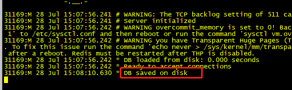
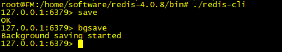
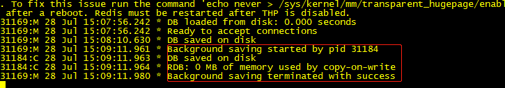
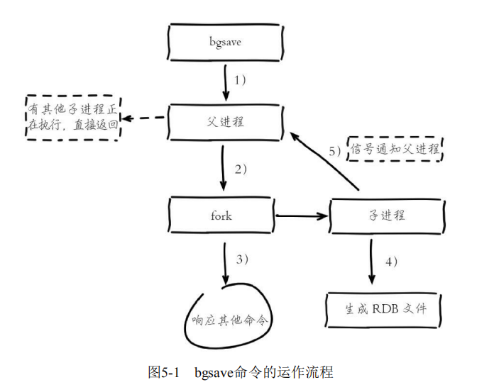
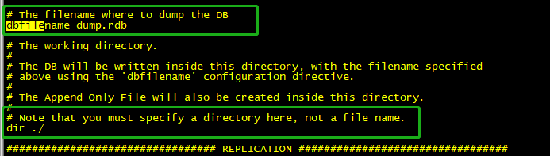
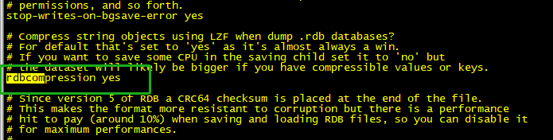
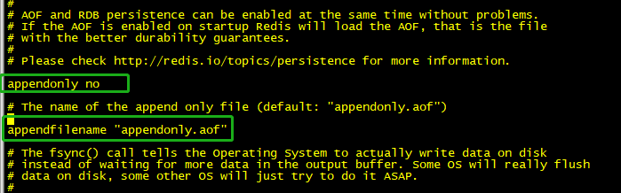
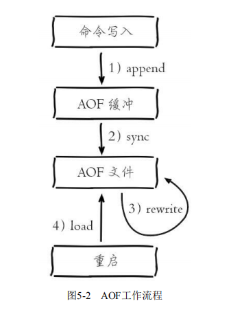

> Redis 持久化
- Redis 支持RDB和AOF两种持久化机制，持久化功能有效地避免因进程退出造成的数据丢失问题，当下次重启时利用之前持久化的文件即可实现数据恢复

> RDB

- RDB 持久化是把当前进程数据生成快照保存到硬盘的过程，触发RDB持久化过程分为手动触发和自动触发
- 手动触发分别对应save和bgsave命令:
- - 1. save命令: 阻塞当前Redis服务器，指定RDB过程完成为止，对于内存比较大的实例会造成长时间阻塞，线上环境不建议使用.
- - redis-cli
  

- - redis-server

- - 2. bgsave命令：Redis进程执行fork操作创建子进程，RDB持久化过程有子进程负责，完成后自动结束。阻塞只发生在fork阶段，一般时间很短

- - redis-cli

- - redis-server

- Redis内部所有涉及RDB的操作都采用bgsave的方式
- 自动触发RDB的持久化机制：
- - 1. 使用save相关配置，如“save m n ",表示m秒内数据集存在n次修改时，自动触发bgsave
- - 2. 如果从节点执行全量复制操作，主节点自动执行bgsave生成RDB文件发送个从节点
- - 3. 执行debug reload 命令重新加载Redis时，也会自动触发save操作
- - 4. 默认情况下执行shutdown命令时，如果没有开启AOF持久化功能则自动执行bgsave

> bgsave 持久化流程

> RDB 文件的处理

- 保存：RDB 文件保存在dir配置指定的目录下，文件名通过dbfilename配置指定。可以通过执行config set dir{new Dir} 和 config set dbfilename{new FileName} 运行期动态执行，当下次运行时RDB文件会保存到新目录。

- 当遇到坏盘或磁盘写满等情况时，可以通过 config set dir{new Dir}在线修改文件路径到可用的磁盘路径，之后执行bgsave进行磁盘切换，同一适用于AOF持久化文件   
- 压缩：Redis默认采用LZF算法对生成的RDB文件做压缩处理，压缩后的文件远远小于内存大小，默认开启，可用通过参数 config set rdbcompression{yes|no} 动态修改，配置文件为：

- 校验：如果Redis 加载损坏的RDB文件时拒绝启动，可用使用Redis提供的redis-check-dump工具检测RDB文件并获取对应的错误报告

> AOF 

- AOF(append only file) 持久化：以独立日志的方式记录每次写命令，重启时在重新执行AOF文件中的命令达到恢复数据的目的
- 作用：解决了数据持久化的实时性
- 开启AOF功能需要设置配置：appendonly yes,默认不开启.AOF文件名通过appendfilename配置设置，默认文件名是appendonly.aof.

- AOF 工作流程：

- AOF命令写入的内容直接是文本协议格式
- AOF 为什么把命令追加到aof_buf中？
- - Redis使用单线程响应命令，如果每次写AOF文件命令都直接追加到硬盘，那么性能完全取决于当前硬盘负载.先写入缓冲区aof_buf中，还有另一好处，Redis可以提供多种缓冲区同步硬盘的策略，在性能和安全性方面做出平衡
- AOF 缓冲区同步文件策略，由参数appendfsync控制：

| 可配置值 | 说明 |
| ---- | ---- |
| always | 命令写入aof_buf后调用系统fsync操作同步到AOF文件，fsync完成后线程返回 |
| everysec | 命令写入aof_buf 后调用系统write操作，write完成后线程返回。fsync同步文件操作由专门线程每秒调用一次 |
| no | 命令写入aof_buf 后调用系统write操作，不对AOF文件做fsync同步，同步硬盘操作由操作系统负责，通常同步周期最长30秒 |

- 系统调用write和fsync：
- - write 操作会触发延迟写(delayed write)机制。Linux 在内核提供页缓冲区用来提高硬盘IO性能。write操作在写入系统缓冲区后直接返回。同步硬盘操作依赖于系统调度机制，例如：缓冲区页空间写满或达到特定时间周期。同步文件之前，如果此时系统故障宕机，缓冲区内数据将丢失.
- fsync 针对单个文件操作(比如AOF文件),做强制硬盘同步，fsync将阻塞直到写入硬盘完成后返回，保证了数据持久化。
- AOF 文件重写是把Redis进程内的数据转化为写命令同步到新AOF文件的过程。
- 重写后的AOF文件为什么可以变小?
- - 1. 进程内已经超时的数据不再写入文件
- - 2. 重写使用进程内数据直接生成，这样新的AOF文件只保留最终数据的写入命令
- - 3. 多条写命令可以合并为一个
- AOF 重写降低了文件占用空间，除此之外，另一个目的是：更小的AOF文件可以更快地被Redis加载