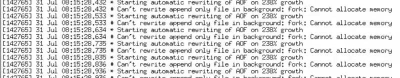

> Redis  线上常见问题

- Can't rewrite append only file in background: fork: Cannot allocate memory

- /proc/sys/vm/overcommit_memory
- - overcommit_memory 参数说明：设置内存分配策略(可选,根据服务器的实际情况进行设置)
- - 1. 0 :表示内核将检查是否有足够的可用内存供应用进程使用;如果有足够的可用内存，内存申请允许；否则，内存申请失败，并把错误返回给应用程序
- - 2. 1 :表示内核允许分配所有的物理内存，而不管当前的内存状态如何
- - 3. 2 :表示内核允许分配超过所有物理内存和交换空间总和的内存
- redis在dump数据的时候，会fork出一个子进程，理论上child进程所占用的内存和parent是一样的，比如parent占用的内存为8G，这时同样分配8G给child，如果内存无法负担，往往会造成redis服务器的down机或者IO负载过高，效率下降。所以比较优化的内存分配策略应该设置为1(表示内核允许分配所有的物理内存，而不管当前的内存状态如何)